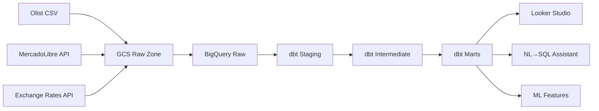
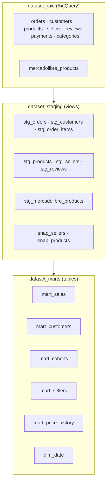

# E-Commerce Analytics Platform

Production-grade data engineering platform combining historical e-commerce data (Olist Brazil) with live market data (MercadoLibre Argentina API).

[](https://github.com/atmades/ecommerce-analytics/actions/workflows/ci.yml)

---

## Architecture



**Stack:** Python · dbt Core 1.8 · BigQuery · Airflow 2.9 · Docker · GCP Secret Manager · GitHub Actions · Ollama/Mistral

---

## Data Model



| Mart | Grain | Rows | Description |
|------|-------|------|-------------|
| `mart_sales` | order | 97k | Delivered orders with revenue and delivery metrics |
| `mart_customers` | customer | 93k | LTV, RFM segmentation, order history |
| `mart_cohorts` | cohort × month | — | Retention analysis |
| `mart_sellers` | seller | 3k | Performance and quality metrics |
| `mart_price_history` | product × period | — | SCD Type 2 price changes (MercadoLibre) |
| `dim_date` | day | 5k | Calendar with BR/AR holidays |

**Data quality:** 38/38 tests passing ✅

---

## Quick Start

### Prerequisites
- Docker Desktop · Python 3.11+ · GCP project · Ollama

### 1. Clone and install

```bash
git clone https://github.com/atmades/ecommerce-analytics.git
cd ecommerce-analytics
python -m venv .venv && source .venv/bin/activate
pip install -e .
cp .env.example .env  # fill in your GCP values
```

### 2. GCP Setup

```bash
gcloud auth login
gcloud config set project YOUR_PROJECT_ID

# Create datasets
bq mk --dataset --location=US YOUR_PROJECT:dataset_raw
bq mk --dataset --location=US YOUR_PROJECT:dataset_staging
bq mk --dataset --location=US YOUR_PROJECT:dataset_marts

# Service account
gcloud iam service-accounts create sa-ecommerce
gcloud projects add-iam-policy-binding YOUR_PROJECT \
  --member="serviceAccount:sa-ecommerce@YOUR_PROJECT.iam.gserviceaccount.com" \
  --role="roles/bigquery.admin"
gcloud iam service-accounts keys create ~/.gcp/ecommerce-sa.json \
  --iam-account=sa-ecommerce@YOUR_PROJECT.iam.gserviceaccount.com
```

### 3. Download Olist data

Download from [Kaggle](https://www.kaggle.com/datasets/olistbr/brazilian-ecommerce) → extract to `data/raw/`

### 4. Run pipeline

```bash
# Ingestion
python ingestion/load_olist.py
python ingestion/load_to_bq.py

# dbt
cd dbt && dbt deps && dbt snapshot && dbt run && dbt test

# Airflow
docker compose up -d  # → http://localhost:8080 (admin/admin)
```

### 5. NL→SQL Assistant

```bash
brew install ollama && brew services start ollama
ollama pull mistral
python llm/nl_to_sql.py
```

---

## Key Design Decisions

| Decision | Choice | Rationale |
|----------|--------|-----------|
| Warehouse | BigQuery | Free tier, GCS integration, market standard |
| Transform | dbt Core | Declarative SQL, testing, lineage |
| History | SCD Type 2 snapshots | Full price/status history, no data loss |
| Ingestion | CSV→GCS→BQ | Raw zone as reprocessable source of truth |
| LLM | Ollama/Mistral | Free, local, no API limits |

See [Architecture Decision Records](docs/decisions/) for details.

---

## Known Limitations

- `dbt sl query` requires dbt Cloud — metrics.yml follows MetricFlow spec, ready for upgrade to dbt 1.9+
- Exchange rates ingestion is a stub — BRL→USD uses static approximation
- MercadoLibre `/search` returns 403 — using highlights + products endpoints instead
- Olist data is historical (2016–2018) — retention metrics reflect past, not live activity
- Terraform IaC planned but not yet implemented

---

*Built as a portfolio project demonstrating production-grade Data Engineering practices.*