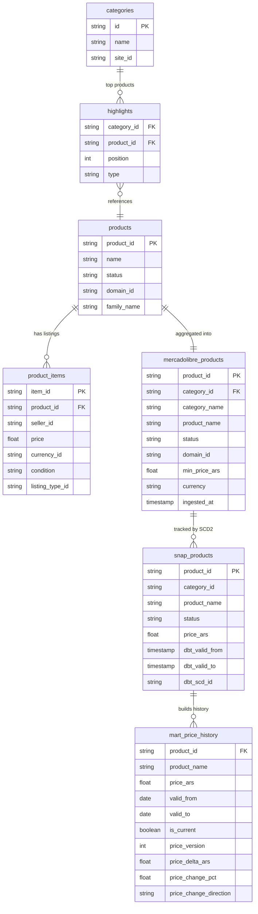

# MercadoLibre Data Flow

This document describes the data journey from MercadoLibre Argentina API
to the final analytics mart.

---

## API → BigQuery → dbt → Mart

---

## Layer descriptions

**API layer** (`categories` → `highlights` → `products` → `product_items`)
Not stored in BigQuery — these are sequential API calls in `load_mercadolibre.py`.
For each of the first 5 categories we fetch top 10 products via highlights,
then get product details and minimum price across all seller listings.

**Raw layer** (`dataset_raw.mercadolibre_products`)
Single table written to BigQuery after each daily run.
One row per product with aggregated `min_price_ars` across all sellers.
Format: JSONL via GCS → BigQuery native load, `WRITE_TRUNCATE`.

**Snapshot layer** (`dataset_staging.snap_products`)
dbt SCD Type 2 snapshot tracking changes in `price_ars`, `status`, `category_id`.
Each price change creates a new row with `dbt_valid_from` / `dbt_valid_to` period.
Run before staging models in Airflow DAG to capture daily price deltas.

**Mart layer** (`dataset_marts.mart_price_history`)
Final analytics table built on top of `snap_products`.
Shows price direction (`increase` / `decrease` / `unchanged`),
delta in ARS and percentage change per product per period.

---

## Fault tolerance

| Mechanism | Purpose |
|-----------|---------|
| OAuth2 auto-refresh | Token renewed 60s before expiry — no manual intervention |
| Token bucket rate limiter | 600 req/min cap — prevents API quota errors |
| Circuit breaker | After 5 failures → OPEN state → DAG continues in degraded mode |
| Idempotent load | `WRITE_TRUNCATE` — safe to re-run without duplicates |

---

## Known limitations

- `/sites/MLA/search` returns 403 — workaround via highlights + products endpoints
- `MLAU*` product IDs (user-type listings) return 403 — skipped by design
- Price history accumulates only from first ingestion date forward
- Free tier: 5 categories × 10 products = ~43–50 products per daily run

See also: [ADR-006 — SCD Type 2 for price tracking](decisions/ADR-006-scd-type2-snapshots.md)